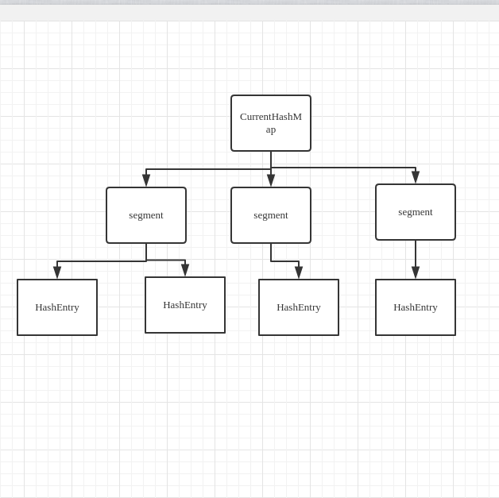

# ConcurrentHashMap

底层利用ReentrantLock实现

# jdk 1.7 实现



利用segment和hashEntry实现，segment继承ReentrantLock

先hash一次获取到对应的segment，在进行一次hash，找到对应的hashEntry

## get方法
ConcurrentHashMap 的 get 方法是非常高效的，因为整个过程都不需要加锁。

只需要将`Key`通过`Hash`之后定位到具体的`Segment`，
再通过一次`Hash`定位到具体的元素上。
由于`HashEntry`中的`value`属性是用`volatile`关键词修饰的，
保证了内存可见性，所以每次获取时都是最新值
## put 方法
首先也是通过 Key 的 Hash 定位到具体的 Segment，在 put 之前会进行一次扩容校验
volatile并不能保证原子性，所以还是要加锁

# jdk 1.8 实现

jdk 1.8 重新启动synchronized+CAS实现
- >CAS 
    
    CompareAndSwap or CompareAndSet
    # put方法
    ```java
    final V putVal(K key, V value, boolean onlyIfAbsent) {
            if (key != null && value != null) {
                int hash = spread(key.hashCode());
                int binCount = 0;
                ConcurrentHashMap.Node[] tab = this.table;
    
                while(true) {
                    int n;
                    while(tab == null || (n = tab.length) == 0) {
                        tab = this.initTable(); 
                    }
    
                    ConcurrentHashMap.Node f;
                    int i;
                    if ((f = tabAt(tab, i = n - 1 & hash)) == null) {
                        if (casTabAt(tab, i, (ConcurrentHashMap.Node)null, new ConcurrentHashMap.Node(hash, key, value))) {
                            break;
                        }
                    } else {
                        int fh;
                        if ((fh = f.hash) == -1) {
                            tab = this.helpTransfer(tab, f);
                        } else {
                            Object fk;
                            Object fv;
                            if (onlyIfAbsent && fh == hash && ((fk = f.key) == key || fk != null && key.equals(fk)) && (fv = f.val) != null) {
                                return fv;
                            }
    
                            V oldVal = null;
                            synchronized(f) {
                                if (tabAt(tab, i) == f) {
                                    if (fh < 0) {
                                        if (f instanceof ConcurrentHashMap.TreeBin) {
                                            binCount = 2;
                                            ConcurrentHashMap.TreeNode p;
                                            if ((p = ((ConcurrentHashMap.TreeBin)f).putTreeVal(hash, key, value)) != null) {
                                                oldVal = p.val;
                                                if (!onlyIfAbsent) {
                                                    p.val = value;
                                                }
                                            }
                                        } else if (f instanceof ConcurrentHashMap.ReservationNode) {
                                            throw new IllegalStateException("Recursive update");
                                        }
                                    } else {
                                        label124: {
                                            binCount = 1;
    
                                            ConcurrentHashMap.Node e;
                                            Object ek;
                                            for(e = f; e.hash != hash || (ek = e.key) != key && (ek == null || !key.equals(ek)); ++binCount) {
                                                ConcurrentHashMap.Node<K, V> pred = e;
                                                if ((e = e.next) == null) {
                                                    pred.next = new ConcurrentHashMap.Node(hash, key, value);
                                                    break label124;
                                                }
                                            }
    
                                            oldVal = e.val;
                                            if (!onlyIfAbsent) {
                                                e.val = value;
                                            }
                                        }
                                    }
                                }
                            }
    
                            if (binCount != 0) {
                                if (binCount >= 8) {
                                    this.treeifyBin(tab, i);
                                }
    
                                if (oldVal != null) {
                                    return oldVal;
                                }
                                break;
                            }
                        }
                    }
                }
    
                this.addCount(1L, binCount);
                return null;
            } else {
                throw new NullPointerException();
            }
        }
    ```
    
    - 根据 key 计算出 hashcode 。
    - 判断是否需要进行初始化。
    - f 即为当前 key 定位出的 Node，如果为空表示当前位置可以写入数据，利用 CAS 尝试写入，失败则自旋保证成功。
    - 如果当前位置的 hashcode == MOVED == -1,则需要进行扩容。
    - 如果都不满足，则利用 synchronized 锁写入数据。
    - 如果数量大于 TREEIFY_THRESHOLD 则要转换为红黑树

# 总结
1.8 在 1.7 的数据结构上做了大的改动，
采用红黑树之后可以保证查询效率（O(logn)），
甚至取消了 ReentrantLock 改为了 synchronized