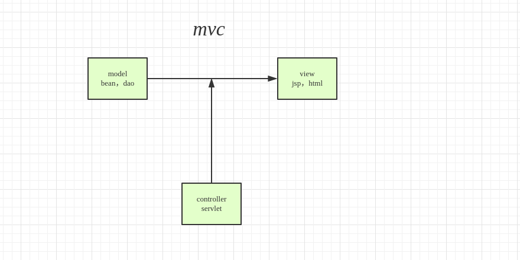

# java基础笔记
# string 类
1 **字符串‘+’，字符串拼接的方法及区别**
    
    +: 
        String a = "111";
        String d = a + "asds"
        实际上调用string d = (new StringBuild(String.valueOf(a)).append(asds)).tostring();
    append(),concat()

2 **StringBuffer,StringBuilder**
    
    1 StringBuffer是线程安全的，StringBuilder不是线程安全的
    2 在大量字符串拼接时,如果程序是在单线程下运行，或者是不必考虑到线程同步问题，我们应该优先使用StringBuilder类；当然，如果要保证线程安全，自然非StringBuffer莫属了
    3 

3 **String 字符串常量**

String 是不可变的对象,线程安全的，线程安全
不可变对象是线程安全的，在线程之间可以相互共享，不需要利用特殊机制来保证同步问题，因为对象的值无法改变。可以降低并发错误的可能性，因为不需要用一些锁机制等保证内存一致性问题也减少了同步开销。
易于构造、使用和测试

    String s = “123456”
    String s = "ABCabc";
s只是一个引用，它指向了一个具体的对象，当s=“123456”; 
这句代码执行过之后，又创建了一个新的对象“123456”， 
而引用s重新指向了这个心的对象，原来的对象“ABCabc”还在内存中存在，并没有改变
    
    a = a.replace("A","a")
  
a的值看似改变了，其实也是同样的误区。再次说明， a只是一个引用， 
不是真正的字符串对象，在调用a.replace(‘A’, ‘a’)时， 方法内部
创建了一个新的String对象，并把这个心的对象重新赋给了引用

    String str1 = "abc";
    String str2 = "a" + "bc";
    String str3 = new String("abc");
    String str4 = new String("ab") + "c";
    System.out.println(str1.equals(str2));// true
    System.out.println(str1.equals(str3));//true
    System.out.println(str1 == str2);//true
    System.out.println(str1 == str3);//false
    System.out.println(str2 == str3);//false
    System.out.println(str2 == str4);//false

# equals 与 == 比较
    equals 比较的是值，==比较的是引用
    当没有重写equals方法时，euqals 等价于 == 
    
    ==判断的是两个对象的地址是不会相等，即判断两个对象的地址是不是相等(基本数据类型判断值，引用数据类型比较引用地址是不是相等)
    
    equals() : 它的作用也是判断两个对象是否相等。但它一般有两种使用情况：
    情况1：类没有覆盖 equals() 方法。则通过 equals() 比较该类的两个对象时，等价于通过“==”比较这两个对象。
    情况2：类覆盖了 equals() 方法。一般，我们都覆盖 equals() 方法来两个对象的内容相等；若它们的内容相等，则返回 true (即，认为这两个对象相等)。
    
# 重写equals时重写hashcode
    

# 成员变量，局部变量，类变量
1. 从形式上看：成员变量是属于`类`的，局部变量是定义在`方法内的或者方法参数`,
成员变量可以被 public,private,static 等修饰符所修饰，而局部变量不能被访问控制修饰符及 static 所修饰；
但是，成员变量和局部变量都能被 final 所修饰
2. 从变量在内存的存储方式来看：如果成员变量被`statis`修饰符修饰，那么这个变量是属于`类`的，
如果没有被`statis`修饰，则是属于`实例`的，java中对象是存放在堆内存中，而局部变量是存放在栈中
3. 从变量在内存中的生存时间上看:
成员变量是对象的一部分，它随着对象的创建而存在，
而局部变量随着方法的调用而自动消失
4. 从有没有赋初值划分:成员变量如果没有被赋初值:则会自动以类型的默认值而赋值,
而局部变量则不会赋初值

# java 伪泛型
java中定义在方法里面的泛型会出现泛型擦除。

    

# MVC概念
M：model 模型，模型就是数据，bean，dao等

V：view 试图  jsp ，html

V:controller 控制 将模型中的不同的数据显示到不同的试图中去

# final关键字作用
 final 修饰：`方法，变量，类`
    
    1 修饰方法：方法不可以继承
    2 修饰变量：
       - 修饰成员变量：值不能修改
       - 修饰引用对象：引用不能修改，只能修改
    3 修饰类：类不能继承
