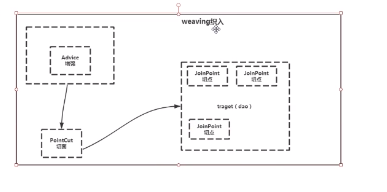

# AOP 面向切面编程 
    
## oop 面向对象编程
   
    oop 从上而下的过程 浏览器login -> controller -> service -> dao -> MySQL
    
    AOP               log       -> shiro权限 -> 事务回滚
    
> AOP是一种思想，实现AOP的的有Spring AOP ，AspectJ

# AspectJ

- Aspect 
    
     In Spring AOP, aspects are implemented by using regular classes (the schema-based approach) 
     or regular classes annotated with the @Aspect annotation 
     在spring AOP中使用xml或者annotation注解的方式实现标识一个Aspect
     
- JoinPoint 

    连接点: a join point always represents a method execution 比如login方法
    
    一个target会有多个切点

- PointCut 
    
    切点： pointcut @pointcut（“execution（*包.*(..方法)）”） 
    
- Advice
    
    Action taken by an aspect at a particular join point
    
    增强 增强类型：前置，后置，环绕（@Around）
- Weaving: 
    
    织入：linking aspects with other application types or objects to create an advised object. 
    
    This can be done at compile time (using the AspectJ compiler, for example), load time, or at runtime.
    
    Spring AOP, like other pure Java AOP frameworks, performs weaving at runtime.

- [AOP proxy](proxy.md): 
    
    代理：
    An object created by the AOP framework in order to implement the aspect contracts (advise method executions and so on). 
    In the Spring Framework, an AOP proxy is a **JDK dynamic proxy** or a **CGLIB proxy**
    
- 实现方式
    
    + execution: For matching method execution join points. This is the primary pointcut designator to use when working with Spring AOP.
    
    + within: Limits matching to join points within certain types (the execution of a method declared within a matching type when using Spring AOP).
    
    + this: Limits matching to join points (the execution of methods when using Spring AOP) where the bean reference (Spring AOP proxy) is an instance of the given type
    
    
>1 <aop-config> 基于配置
    
        <aop:config>
                <aop:pointcut id="loggerCutpoint"
                    expression=
                    "execution(* com.how2java.service.ProductService.*(..)) "/>
                     
                <aop:aspect id="logAspect" ref="loggerAspect">
                    <aop:around pointcut-ref="loggerCutpoint" method="log"/>
                </aop:aspect>
        </aop:config>
    
> 2 @Aspect 基于注解
        
        @Aspect
        @Component
        public class UserAspect {
        
            @Pointcut("execution(* com.example.demo.Service.*.*(..))")
            public void pointcut(){
        
            }
            @Around("com.example.demo.UserAspect.pointcut()")
            public void around(){
        
            }
        
        }
    
    
    