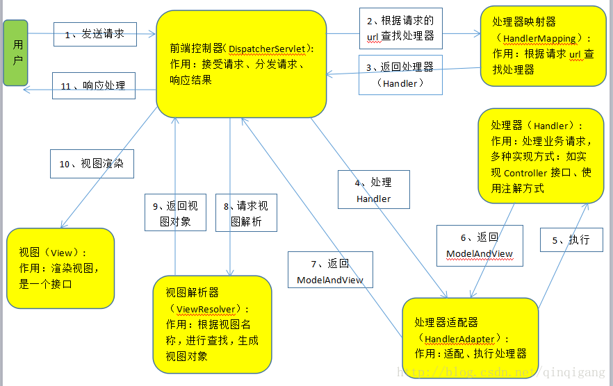

# spring MVC
MVC 框架
> spring MVC  流程图  
>图片来源网络

- 配置DispatchServlet，拦截前端的请求，解析url
- 根据url，调用的HandlerMapping获取符合的Handler，
- DispatchServlet 根据 Handler 找到 HandlerAdapter
- HandlerAdapter 处理相关服务，model，bean，service等
- DispatchServlet 将Model中的数据显示到View-jsp中去

