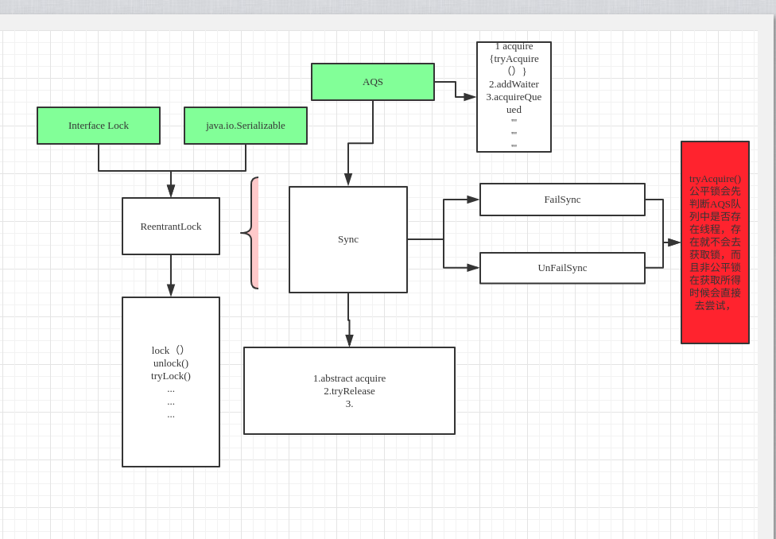

# ReentrantLock 实现原理
使用synchronized关键字来做同步处理

基于AQS(AbstractQueuedSynchronized)实现的。

是一个**重入锁**：一个线程获得了锁之后仍然可以反复的加锁，不会出现自己阻塞自己的情况。

# 锁类型
```
    默认是非公平锁，在创建时可以指定锁的类型
    public ReentrantLock() {
        sync = new NonfairSync();
    }

    /**
     * Creates an instance of {@code ReentrantLock} with the
     * given fairness policy.
     *
     * @param fair {@code true} if this lock should use a fair ordering policy
     */
    public ReentrantLock(boolean fair) {
        sync = fair ? new FairSync() : new NonfairSync();
    }

```
# 公平锁
```java
    /**
     * Sync object for fair locks
     */
    static final class FairSync extends Sync {
        private static final long serialVersionUID = -3000897897090466540L;

        final void lock() {
            acquire(1);
        }

        /**
         * Fair version of tryAcquire.  Don't grant access unless
         * recursive call or no waiters or is first.
         */
        protected final boolean tryAcquire(int acquires) {
            final Thread current = Thread.currentThread();
            int c = getState();
            if (c == 0) {
                if (!hasQueuedPredecessors() &&
                    compareAndSetState(0, acquires)) {
                    setExclusiveOwnerThread(current);
                    return true;
                }
            }
            else if (current == getExclusiveOwnerThread()) {
                int nextc = c + acquires;
                if (nextc < 0)
                    throw new Error("Maximum lock count exceeded");
                setState(nextc);
                return true;
            }
            return false;
        }
    }
```
- 首先会判断 `AQS`中的state是否等于0，0表示当前线程没有获取锁。

- 会在 hasQueuedPredecessors()判断当前AQS的队列中是否有其他线程，
如果存在，则不会去尝试获取锁，

- 如果队列中没有线程就利用 CAS 来将 AQS 中的 state 修改为1，也就是获取锁，
获取成功则将当前线程置为获得锁的独占线程(setExclusiveOwnerThread(current))

# 非公平锁
```java
    static final class NonfairSync extends Sync {
        private static final long serialVersionUID = 7316153563782823691L;
        
        /**
         * Performs lock.  Try immediate barge, backing up to normal
         * acquire on failure.
         */
        final void lock() {
            if (compareAndSetState(0, 1))
                setExclusiveOwnerThread(Thread.currentThread());
            else
                acquire(1);
        }
        
        protected final boolean tryAcquire(int acquires) {
            return nonfairTryAcquire(acquires);
        }
    }
        // 
        final boolean nonfairTryAcquire(int acquires) {
            final Thread current = Thread.currentThread();
            int c = getState();
            if (c == 0) {
                if (compareAndSetState(0, acquires)) {
                    setExclusiveOwnerThread(current);
                    return true;
                }
            }
            else if (current == getExclusiveOwnerThread()) {
                int nextc = c + acquires;
                if (nextc < 0) // overflow
                    throw new Error("Maximum lock count exceeded");
                setState(nextc);
                return true;
            }
            return false;
        }
```
非公平锁在lock时平不会去试图去判断AQS队列中是否存在线程，而是直接去获取锁，
而且在tryAcquire()时也是直接去获取锁，

# 写入队列
如果 tryAcquire(arg) 获取锁失败，则需要用 addWaiter(Node.EXCLUSIVE) 将当前线程写入队列中。

写入之前需要将当前线程包装为一个 Node 对象(addWaiter(Node.EXCLUSIVE))。
```
    public final void acquire(int arg) {
        if (!tryAcquire(arg) &&
            acquireQueued(addWaiter(Node.EXCLUSIVE), arg))
            selfInterrupt();
    }
    
```
首先判断队列是否为空，不为空时则将封装好的 Node 利用 CAS 写入队尾，
如果出现并发写入失败就需要调用 enq(node); 来写入了。
```
    private Node addWaiter(Node mode) {
        Node node = new Node(Thread.currentThread(), mode);
        // Try the fast path of enq; backup to full enq on failure
        Node pred = tail;
        if (pred != null) {
            node.prev = pred;
            if (compareAndSetTail(pred, node)) {
                pred.next = node;
                return node;
            }
        }
        enq(node);
        return node;
    }
```

# 挂起线程

写入队列之后需要将当前线程挂起(利用acquireQueued(addWaiter(Node.EXCLUSIVE), arg))：
```
    final boolean acquireQueued(final Node node, int arg) {
        boolean failed = true;
        try {
            boolean interrupted = false;
            for (;;) {
                final Node p = node.predecessor();
                if (p == head && tryAcquire(arg)) {
                    setHead(node);
                    p.next = null; // help GC
                    failed = false;
                    return interrupted;
                }
                if (shouldParkAfterFailedAcquire(p, node) &&
                    parkAndCheckInterrupt())
                    interrupted = true;
            }
        } finally {
            if (failed)
                cancelAcquire(node);
        }
    }
```
# 释放锁
```
    public void unlock() {
        sync.release(1);
    }
    
    public final boolean release(int arg) {
        if (tryRelease(arg)) {
            Node h = head;
            if (h != null && h.waitStatus != 0)
                unparkSuccessor(h);
            return true;
        }
        return false;
    }
    protected final boolean tryRelease(int releases) {
        int c = getState() - releases;
        if (Thread.currentThread() != getExclusiveOwnerThread())
            throw new IllegalMonitorStateException();
        boolean free = false;
        if (c == 0) {
            free = true;
            setExclusiveOwnerThread(null);
        }
        setState(c);
        return free;
    }
    
```
非公平锁和公平锁释放的过程是一样的，都会掉用Sync的tryRelease方法，
如果当前重入锁的数量为0，则就调用unparkSuccessor(h)方法释放锁，

# 总结
在定义ReentrantLock 时能定义锁的类型，默认是非公平锁，

公平锁流程
        
    java.util.concurrent.locks.ReentrantLock.FairSync.lock
     ->java.util.concurrent.locks.AbstractQueuedSynchronizer.acquire
     | ->java.util.concurrent.locks.ReentrantLock.FairSync.tryAcquire
     | ->java.util.concurrent.locks.AbstractQueuedSynchronizer.hasQueuedPredecessors
     |   ->java.util.concurrent.locks.AbstractQueuedSynchronizer.compareAndSetState
     |    ->java.util.concurrent.locks.AbstractOwnableSynchronizer.setExclusiveOwnerThread
     ->java.util.concurrent.locks.AbstractQueuedSynchronizer.addWaiter    
      ->java.util.concurrent.locks.AbstractQueuedSynchronizer.acquireQueued
     
锁的过程中


