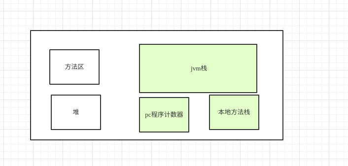
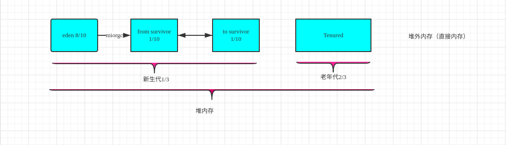

# jvm 标准

# 方法区 jdk1.7
方法区主要存放已经被虚拟机加载的类的信息，如`常量，静态常量，方法名字，类的名字，父类，以及
一些即时编译器编译的代码信息`，也被叫做`永久代`，
可利用参数`-XX:PermSize -XX:MaxPermSize`控制初始化方法区和最大方法区大小。

# 元数据区 jdk1.8
在jdk1.8中，将方法区改为元数据区，默认情况下元数据区域会根据使用情况动态调整，
避免了在 1.7 中由于加载类过多从而出现`java.lang.OutOfMemoryError: PermGen`

#jvm java栈区
jvm虚拟机栈有多个栈帧组成，每个栈帧又由`局部变量表，操作数栈，动态链接，出口记录 `
组成，

# pc 程序计数器
在并发时会经常出现线程之间的上下文切换，而切换后回到哪个方法继续执行由pc决定
当多线程运行时，每个线程切换后需要知道上一次所运行的状态、位置。
由此也可以看出程序计数器是每个线程私有的。

# java 堆内存

java 堆内存 是整个虚拟机管理的最大内存区域，所有对象的创建都是在这个区域进行内存分配，
新生代和老年代的比例`1：2`，在新生代中又分为eden区,`from,to survivor`区，占比为`8:1:1`,
new的对象一般都是分配在eden区，`eden`区满了，会出现`minorGC`，`轻GC`通常会比较频繁，效率也比较高，
当`老年代`满时会出现[fullGC](GC.md)

# 直接内存

直接内存又称为`Direct Memory（堆外内存`，它并不是由`JVM`虚拟机所管理的一块内存区域。

有使用过`Netty`的朋友应该对这块并内存不陌生，在`Netty`中所有的 IO（nio） 操作都会通过`Native`函数直接分配堆外内存。

它是通过在堆内存中的`DirectByteBuffer`对象操作的堆外内存，避免了堆内存和堆外内存来回复制交换复制，这样的高效操作也称为零拷贝。

既然是内存，那也得是可以被回收的。但由于堆外内存不直接受`JVM`管理，所以常规`GC`操作并不能回收堆外内存。它是借助于老年代产生的`fullGC`顺便进行回收。同时也可以显式调用`System.gc()`方法进行回收（前提是没有使用 -XX:+DisableExplicitGC 参数来禁止该方法）。

# 本地方法栈

# jvm性能调优
调优主要是要减少 full fc 的频率和时间 
full gc 会出现 stop the world
> 性能调优工具 

    jconsole
    JvisualVM

# jvm 常用指令集合

