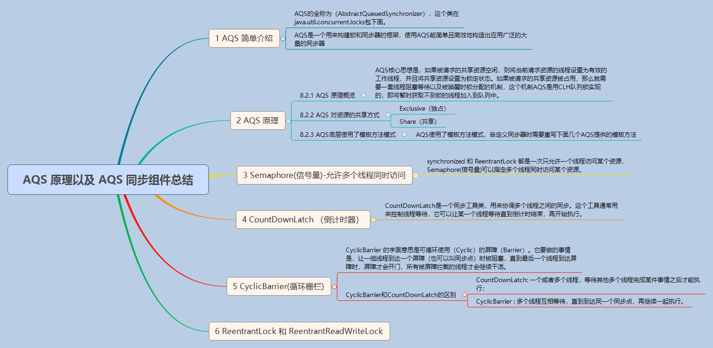

# AQS  原理

利用 一个FIFO的双向循环队列 和一个volatile关键字修饰的变量state实现

不同的自定义同步器争用共享资源的方式也不同。自定义同步器在实现时只
需要实现共享资源state的获取与释放方式即可，至于具体线程等待队列的
维护（如获取资源失败入队/唤醒出队等），AQS已经在顶层实现好了。
自定义同步器实现时主要实现以下几种方法：

- isHeldExclusively()：该线程是否正在独占资源。
    只有用到condition才需要去实现它。
- tryAcquire(int)：独占方式。尝试获取资源，成功则返回true，
  失败则返回false。
- tryRelease(int)：独占方式。尝试释放资源，成功则返回true，
  失败则返回false。
- tryAcquireShared(int)：共享方式。尝试获取资源。
  负数表示失败；0表示成功，但没有剩余可用资源；正数表示成功，且有剩余资源。
- tryReleaseShared(int)：共享方式。尝试释放资源，
   如果释放后允许唤醒后续等待结点返回true，否则返回false。
   
> [利用CAS 实现](CAS.md)

详细介绍[ReenTranLock](../java/java线程/ReentrantLock.md)
 
[http://www.cnblogs.com/waterystone/p/4920797.html][参考博客]

[参考博客]: http://www.cnblogs.com/waterystone/p/4920797.html